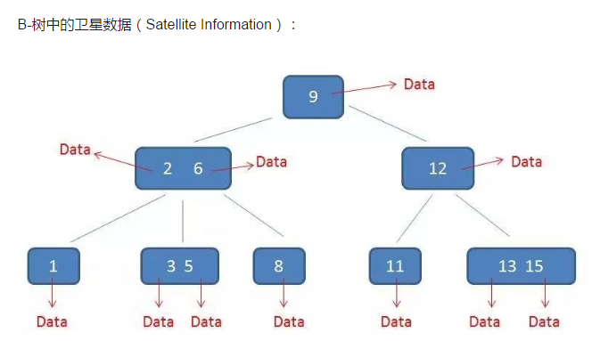
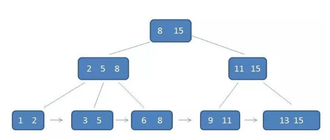
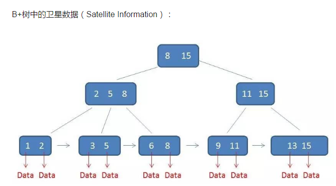

# 树相关算法

* 二叉树
* 二叉搜索树
* 平衡二叉树
* 2-3树
* 2-3-4树
* 红黑树
* B树
* B+树
* LSM树
* Tris树

    
    二叉查找树查询的时间复杂度是O(logn)，性能已经很高了，但是要考虑IO问题，就不得不提起B树了。
    数据索引存在磁盘上，当数据量比较大的时候，索引的大小可能几个G甚至更多。
    利用索引查询的时候，并不能把所有的索引都加载到内存中。
    磁盘IO的次数等于索引数的高度，为了较少磁盘IO，就需要把瘦高的树变成矮胖的数。

##### B树
    B树(B-、B_)大量应用在文件系统和部分数据库索引中，比如MongoDB。
    B数是一种多路平衡查找树，每一个节点最多有m阶的孩子，m的大小取决于磁盘页的大小。
    B树是对二叉查找树的改进，将相关数据集中在一起，一次读取多个数据，减少磁盘操作次数。
    B树优化大块数据数据的读写，减少定位记录需要的中间过程，减速存储数据。
    B树是一种树状存储结构，能够以Olog(n)时间复杂度进行插入、删除、查找。
    B树是一种m阶平衡多叉树，m代表一个节点可以有多少个孩子。当m=2时，是二叉查找树，
    m阶的B树，有如下定义：
    1.根节点至少有2个子节点。
    2.每个非根节点包含的子节点个数[m/2,m]。
    3.所有叶子节点位于同一层。
    4.除根结点以外的所有结点（不包括叶子结点）的度数正好是关键字总数加1。
    5.每个节点的值都是按从小到大顺序排序。
    
    卫星数据：
    所谓卫星数据，指的是索引元素指向的数据记录，比如数据库中的某一行，在B树中无论中间节点和叶子节点都带有卫星数据。
    
 * [参考文章 漫画算法：什么是 B 树？](http://blog.jobbole.com/111757/) 
    
   
    
##### B+树
    B+树是B树的变体，主要好处体现在查询效率上，有着比B树更高的查询效率。Mysql使用B+树索引。
    m阶的B+树，有如下特征：
    1.有k个子树的中间节点包含有k个元素（B树中是k-1个元素），每个元素不保存数据，只用来索引，所有数据都保存在叶子节点。
    2.所有的叶子结点中包含了全部元素的信息，及指向含这些元素记录的指针，且叶子结点本身依关键字的大小自小而大顺序链接。
    3.所有的中间节点(父节点)元素都同时存在于子节点，在子节点元素中是最大（或最小）元素。
    
    
    在B+树中，只有叶子节点带有卫星数据，其余中间节点仅仅是索引，没有任何数据关联。
       
 
    B+树的查询最终查找到叶子节点，而B树只要找到匹配元素即可，无论元素匹配到中间节点还是叶子节点。
    B树查询不稳定，而B+树每次查询都是稳定的。
    
    范围查询B树会很繁琐，而B+数则简单的多，只需要在链表上做遍历即可。
    
    B+树相比B树优势：
    1.IO次数更少：单一节点存储更多的元素，使得查询的IO次数更少。
    2.查询性能稳定：所有查询都要查找到叶子节点，查询性能稳定。
    3.范围查询简单：所有叶子节点形成有序链表，便于范围查询。
    
    插入和删除B+树和B树大同小异。

##### 红黑树
    红黑树是一种自平衡的二叉查找树。除了二叉查找树的基本特性外，还具有下列特性：
    1.节点是红色或黑色。
    2.根节点是黑色。
    3.每个叶子节点都是黑色的空节点（NIL节点）。
    4 每个红色节点的两个子节点都是黑色。(从每个叶子到根的所有路径上不能有两个连续的红色节点)
    5.从任一节点到其每个叶子的所有路径都包含相同数目的黑色节点。

    红黑树的插入和删除时候，红黑树的规则可能会被打破，这时候就需要做一些调整，来继续维持规则。
    比如：变色、左旋转、右旋转。
    
    红黑树的应用有很多，JDK的集合TreeMap和TreeSet底层就是红黑树的实现，在Java8中HashMap也用到了红黑树。
    